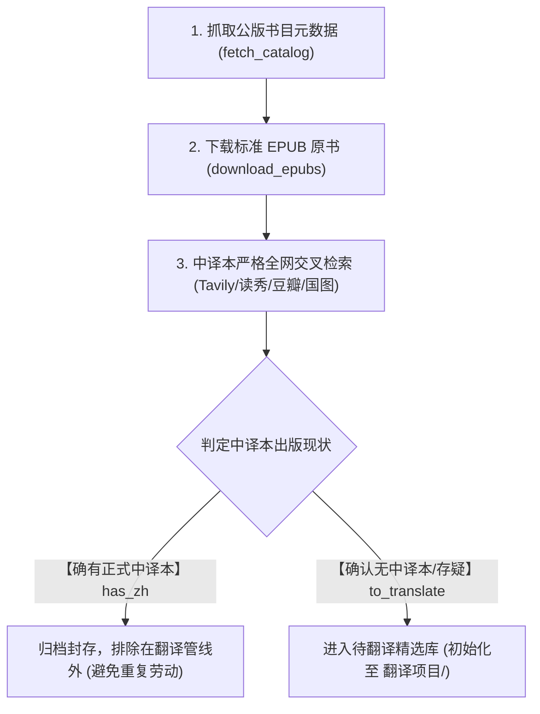

# 阶段一：下载与选品工作流（1_下载与选品WORKFLOW.md）

> 💡 **现状说明**：Standard Ebooks 全量 **1499 本公版原书** 已全部完成下载并安全封存至本地 `~/Downloads/1499_books_epub/`。
> 本文件系统化沉淀全量公版书库的抓取、元数据建立、中译本查重筛查与分流准入标准，作为选品阶段的标准操作规范（SOP）。

---

## 一、阶段定位与目标

本阶段是整个翻译工程的最前置漏斗：
- **目标**：从海量公版英文书库（Standard Ebooks 等）中，严格排查两岸中文出版现状，**精准筛选出“确认无中文译本”或“译介严重缺失”的高价值公版书目**进入翻译管线，坚决避免对已有权威中译本的书籍进行低价值重复翻译。

---

## 二、标准执行流程

### 1. 书目元数据抓取与入库
- 运行元数据抓取脚本（如 `fetch_catalog.py`），从 Standard Ebooks 抓取全量图书元数据（书名、作者、发布时间、难度词数、下载 URL、EPUB 文件名等），输出标准结构化索引 `catalog.json`。

### 2. 原书下载与本地归档
- 运行批量下载脚本（如 `download_epubs.py`），自动获取高排版质量的 EPUB 原书；
- 统一存储于 `~/Downloads/1499_books_epub/`，作为永久底库备查。

### 3. 中译本全网交叉检索规范
对每本书采用多维度组合检索（使用 Tavily API、读秀学术搜索、全国图书馆联合目录、豆瓣读书等）：
- **英文原名 + 作者名**（如 `\"The Magnificent Ambersons\" Booth Tarkington`）
- **英文原名 + 中文译名推测 / 关键词**（如 `\"The Magnificent Ambersons\" 中译本 出版社`）
- **民国及早期异名译本反向排查**（针对古典名著排查商务印书馆、中华书局早期译介）。

### 4. 严格判定标准

| 判定类别 | 判定标准 | 流水线处置 |
| :--- | :--- | :--- |
| **【确有中译本】 (`has_zh`)** | 中国大陆/港台正规出版社正式出版过中文译本（含全译、节译、编译、外研社双语版）；民国时期正式出版；正式出版文集中的全本。 | **排除**：直接归档封存，不进入翻译队列。 |
| **【确认无中译本】 (`to_translate`)** | 两岸均无正规出版社出版单行本或整册译文（排除英语学习读物、网络民间草译、仅有百科译名词条）。 | **准入**：初始化进入 `翻译项目/`，分配翻译队列。 |
| **【存疑 / 部分收录】 (`to_translate`)** | 仅有部分章节被选集零星收录（如短篇集仅译过一两篇、全诗集仅译过少儿部分），但无整本独立中译本。 | **准入**：进入待翻译队列，并在项目说明中加注说明。 |

---

## 三、产物与总控状态同步

1. **原书归档产物**：`~/Downloads/1499_books_epub/<file>.epub`
2. **选品记录产物**：`catalog.json` 与中译本核实报告（归档至 `~/Downloads/1499_books_epub/archive_scripts/`）
3. **总控登记**：运行 `python scripts/refresh_progress.py`，将全量书目的下载状态与选品分流结果同步呈现至根目录 **`Plan.md`** 全生命周期总表。
